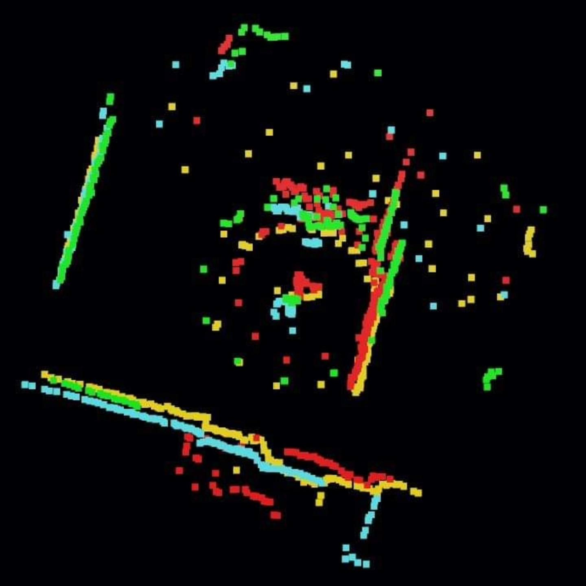
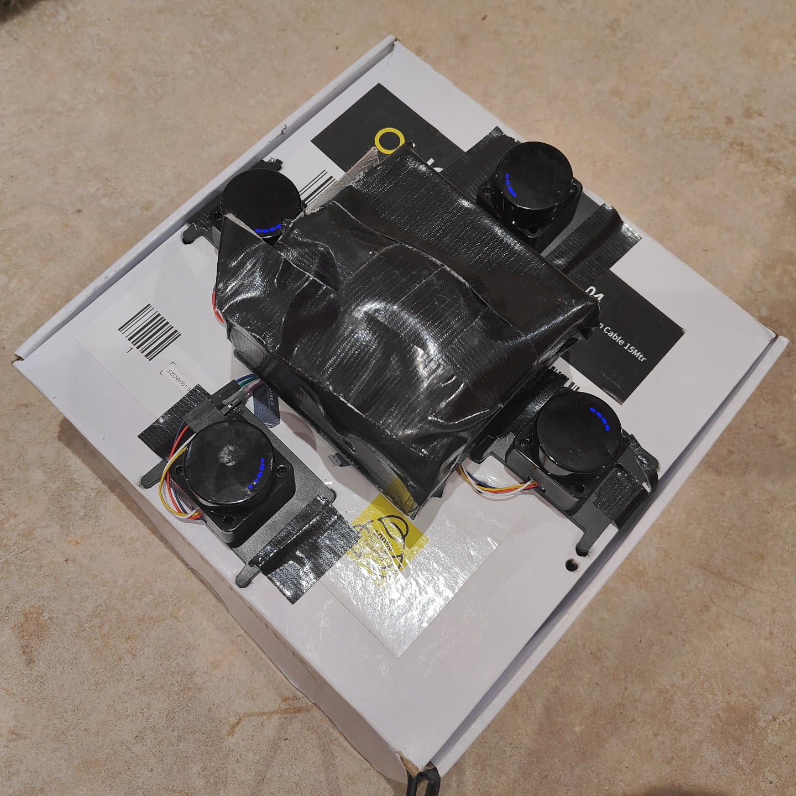
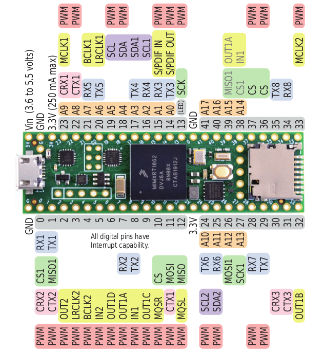

Teensy LIDAR Multiplexor
====

This repo contains an example of how to connect multiple OKDO LD06 LIDAR sensors, and the various whitelabeled versions, to a Teensy 4.1 using the hardware serial. 

The idea here is that you can have one microcontroller handling data from multiple scanners that can then be fed to another microcontroller or computer. This allows you to dedicate cheap hardware to the task or spread the burden over multiple microcontrollers.

The use-case for this in on NE-Where (AKA The Luggage) as I want its basic functions to run from microcontrollers to give instant functionality rather than having to wait for a Pi to boot up. From experience, if something goes wrong in the field it can be a massive pain trying to connect to the Pi never mind troubleshoot it...

I put together a simple Unity application to show the data coming from the four sensors via the Teensy to prove it was working. It's rough so has a lot of artifacts but proves the point.

Each scanner was connected to a separate serial port on the Teensy, I used Serial1 to Serial4 for the scanners and the data was fed out to Serial, in the case of the Teensy that's the USB serial.

Lidar 0     -       Pin 1,  Serial1
Lidar 1     -       Pin 7,  Serial2
Lidar 2     -       Pin 15, Serial3
Lidar 3     -       Pin 16, Serial4

Power was provided to the LIDAR scanners using a dedicated 5v source from a powered USB port, trying to use the same one thats powering the Teensy caused a few of the sensors to shutdown due to lack of power.

Pinout courtesy of [PJRC](https://www.pjrc.com/teensy/pinout.html)

Communications protocol data taken from [this datasheet](https://www.elecrow.com/download/product/SLD06360F/LD19_Development%20Manual_V2.3.pdf).

Notes on Coordinate Systems 
==
It seems that the LIDAR sensor has it's zero angle pointing forwards and it rotates clockwise. It also seems that mathematical equations assume that the zero angle is in line with +x and the angle sweeps anti-clockwise! The code on the Teensy needs to take this in to account.

[Info here](https://math.stackexchange.com/questions/2653099/calculate-cartesian-coordinates-based-on-the-distance-and-the-angle)

Currently this is outputting both raw data and the calculated x, y coordinates. The maths is a bit dicey and I coded this late at night so needs looking at with less tired eyes.

This is provided as-is purely as an example, with no warranty, and used at your own risk.